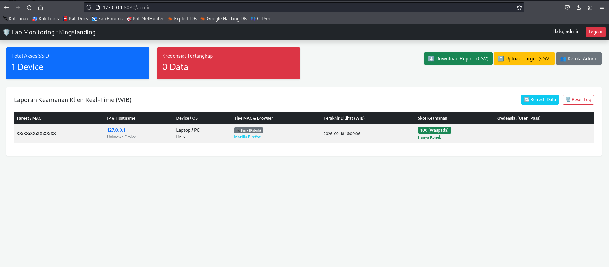
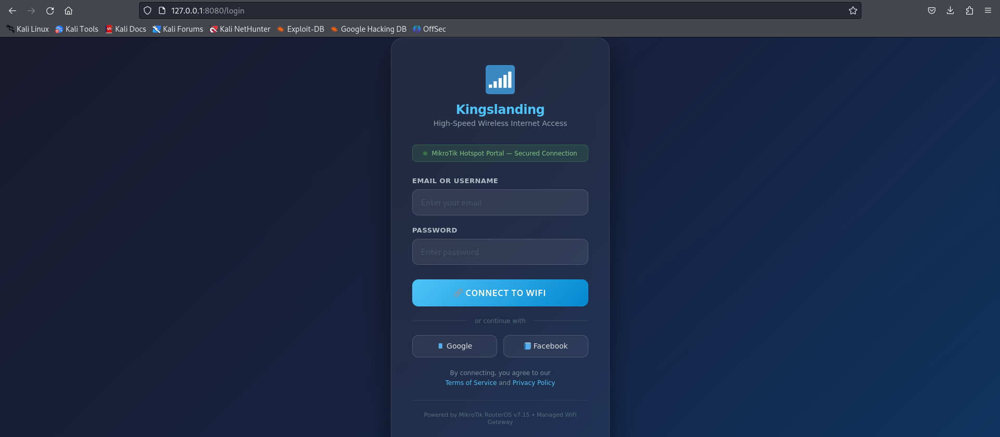
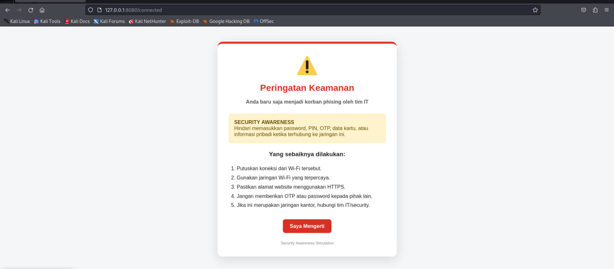

# 🎣 PhishSim-WiFi

**PhishSim-WiFi** adalah alat simulasi *Rogue Access Point* dan *Captive Portal* berbasis Python (Flask). Dibuat secara khusus untuk keperluan edukasi, praktikum laboratorium keamanan jaringan, dan *Security Awareness Training* (Pelatihan Kesadaran Keamanan) bagi institusi maupun perusahaan.

## 📸 Screen

**Dashboard Monitoring Admin (Real-Time WIB)**


**Tampilan Captive Portal (Landing Page Korban)**


**Tampilan Security Awareness**


## 🚀 Fitur

- **All-in-One Deployment:** Menggabungkan `hostapd`, `dnsmasq`, `iptables`, dan Flask Web Server dalam satu eksekusi *script* yang praktis.
- **Advanced Fingerprinting:** Deteksi otomatis Sistem Operasi, Browser, Tipe Perangkat (HP Smartphone vs Laptop/PC), dan deteksi jenis MAC Address (Fisik Pabrik vs Acak/Privasi).
- **Scoring System (Indikator Risiko):** 
  - 🟢 **Skor 100:** Hanya terhubung ke jaringan (Waspada).
  - 🟡 **Skor 60:** Membuka Captive Portal (Rentan).
  - 🔴 **Skor 0:** Memasukkan data kredensial (Berbahaya/Bocor).
- **Interactive Dashboard:** Dilengkapi dengan fitur *Live Monitoring*, manajemen user admin, tombol *Refresh*, dan opsi *Reset Log*.
- **Export & Import Target:** Unduh laporan keamanan ke dalam format CSV, dan *upload* daftar MAC Address target/karyawan.
- **WIB Timezone:** Seluruh log waktu dicatat dalam Waktu Indonesia Barat (UTC+7).

## 🛠️ Requirements

Proyek ini dirancang untuk dijalankan di atas sistem operasi berbasis Debian/Ubuntu (direkomendasikan **Kali Linux**).

Dependensi Sistem:
- `hostapd`
- `dnsmasq`
- `iptables`
- `net-tools`
- `psmisc`

Dependensi Python (Lihat `requirements.txt`):
- `Flask==3.0.3`
- `Werkzeug==3.0.3`

## 📥 Instalasi & Penggunaan

1. **Clone repository ini ke mesin lokal Anda:**
   ```bash
   git clone https://github.com/rizqimaulanaa/PhishSim-Wifi.gi
   cd PhishSim-WiFi
   pip install -r requirements.txt
   chmod +x install.sh
   ./install.sh
   sudo python3 portal.py --interface wlan0 --ssid "KAMPUS_FREE_WIFI"
